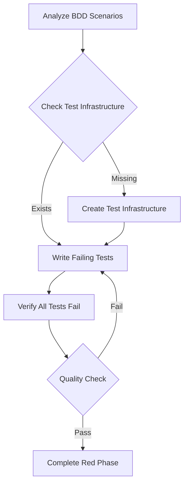

<tdd-red-phase>

### Restrictions
- This phase cannot modify any other file and is limited to creating and editing test files only.  
- Ensures only test files are modified `^(?!.\.(?!test\.|spec\.).$).$`

### High Level Flow


### Critiacal Guidelines
- ALL tests must fail - no exceptions
- After writing tests, verify that 100% of tests fail
- Mock external dependencies (e.g., APIs, databases) to isolate the unit under test.
- Use realistic data structures that cause behavioral failures, not undefined/null returns

### Pre-requisites  
Before writing tests, ensure the necessary test infrastructure exists:  

1. First, locate and read ALL relevant BDD scenarios
   - Extract required components/modules and their relationships
   - Note expected behaviors and outcomes
   - Review implementation notes
   - List all acceptance criteria

2. Check for existing test infrastructure:  
   - [ ] Test utilities and helpers
   - [ ] Mock implementations
   - [ ] Test data generators
   - [ ] Shared test fixtures
   - [ ] Test configuration

3. Create missing infrastructure if needed (respect platform best practice structure):  
   ```
   tests/
   ├── helpers/        # Test utilities
   ├── mocks/         # Test doubles with realistic contracts
   ├── fixtures/      # Test data
   ├── factories/     # Data generators for different scenarios
   └── config/        # Test configuration
   ```

---

## Red Phase Workflow  

### 1. Analyze BDD Scenarios  
- Map each scenario to testable behaviors
- Identify state changes and outputs
- Note required test setup for each scenario
- Document expected data contracts and interfaces

### 2. Set Up Test Infrastructure  
- Create minimal stubs that enable test execution but contain NO business logic
- **Mock Strategy**: Use realistic data structures that define expected contracts
  ```typescript
  // ❌ Don't: Return undefined/null for everything
  getCustomerInfo: jest.fn(() => Promise.resolve(undefined))
  
  // ✅ Do: Define realistic interface, let business logic fail
  getCustomerInfo: jest.fn(() => Promise.resolve({
    entitlements: {}, // Empty = no premium access
    customerInfo: { originalUserId: "test-user" }
  }))
  ```
- **Scenario-Specific Mocks**: Configure different mock states per test scenario
  ```typescript
  beforeEach(() => jest.clearAllMocks());
  
  test("scenario_ActiveSubscription_ShowsPremium", () => {
    mockService.getData.mockResolvedValue({ active: true });
    // Test with active state
  });
  
  test("scenario_NoSubscription_ShowsPaywall", () => {
    mockService.getData.mockResolvedValue({ active: false });
    // Test with inactive state
  });
  ```
- Examples of acceptable stubs:
  - Realistic data structures with failing business logic
  - Empty collections: `[]`, `{}`
  - Inactive states: `{ isActive: false }`
  - Basic structure: interfaces, types, context providers
- Examples of unacceptable stubs:
  - Error handling logic
  - Validation logic  
  - State management
  - Any logic that would make tests pass

### 3. Write Tests with Guard Rails  
- Focus on behavior over implementation
- **Contract Definition**: Tests should document expected interfaces and behaviors
- Use dynamic assertions:
  ```
  // Instead of:
  assert result equals "fixed value"
  
  // Prefer:
  assert result matches expected pattern
  assert result contains required properties
  assert system transitions to expected state
  ```
- Follow naming convention: `test_[Scenario]_[Condition]_[ExpectedResult]`
- One behavior per test
- Maintain test isolation
- Handle async operations appropriately for your platform

### 4. Test Organization
- Group tests by behavior/scenario
- Configure scenario-specific mock states
- Maintain consistent structure:
  ```
  test_suite:
    setup/fixtures
    test_cases:
      scenario_setup (mock configuration)
      action
      verification
    cleanup
  ```

### 5. Verify Failure  
- **ALL tests must fail - no exceptions**
- Tests should fail due to missing implementation (business logic)
- **Quality Failure Check**:
  ```bash
  # ✅ Good failures (business logic missing):
  ✗ Expected premium features to be visible
  ✗ Expected user to be redirected to main app
  
  # ❌ Bad failures (setup issues):
  ✗ Cannot read property 'isActive' of undefined
  ✗ TypeError: getCustomerInfo is not a function
  ```
- Not due to:
  - Setup errors
  - Configuration issues
  - Missing dependencies
  - Invalid test structure
  - Undefined/null mock returns

---

## 6. Evaluate Tests with Guard Rails  

### Scoring System  
Start at 100 points, deduct for violations:  

#### Maintainability (-50)  
- Tests verify behavior not implementation (-25)
- No over-specification (-15)
- Uses proper abstractions (-10)

#### Clarity (-25)  
- Clear test names and structure (-15)
- Single behavior per test (-10)

#### Isolation (-25)  
- Tests are independent (-20)
- Minimal test setup (-5)

#### Contract Quality (-20)
- Mock contracts define realistic interfaces (-10)
- Scenario-specific mock configuration (-10)

### Quality Indicators  
🟢 Excellent (90-100):
- Tests are reliable and maintainable
- Clear behavior verification
- Proper isolation
- Realistic mock contracts

🟡 Needs Improvement (70-89):
- Some technical debt
- Minor clarity issues
- Potential isolation problems

🔴 Requires Revision (<70):
- Significant reliability issues
- Unclear test purpose
- Poor isolation

### Common Pitfalls
❌ Avoid:
- Testing implementation details
- Shared test state
- Complex test setup
- Brittle assertions
- Undefined/null mock returns
- Identical mocks for all scenarios

✅ Prefer:
- Behavior-focused tests
- Independent test cases
- Minimal, clear setup
- Robust assertions
- Realistic mock contracts
- Scenario-specific mock states

---

### 7. Complete the Red Phase  
- Verify all tests fail for the correct reasons running the test command (business logic, not setup)
- Ensure tests meet quality standards
- Confirm mock contracts define expected interfaces
- Document any assumptions or requirements
- Ready for implementation phase
- Use `attempt_completion` to finalize the Red phase only when tests fail for the right reasons and meet guardrail standards, reducing the need for back-and-forth revisions.

### Progress Checklist
- [ ] BDD analysis complete
- [ ] Infrastructure ready
- [ ] Tests written with realistic mock contracts
- [ ] Scenario-specific mock configurations
- [ ] Tests failing correctly (business logic, not setup)
- [ ] Quality standards met

</tdd-red-phase>
