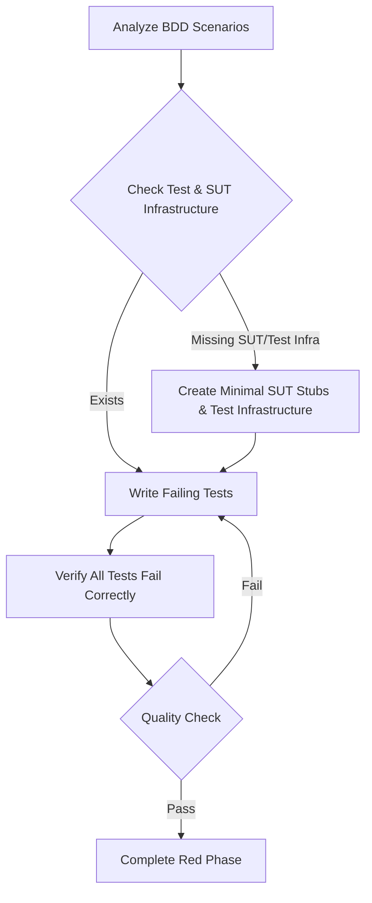

<tdd-red-phase>

### Restrictions
- This phase primarily focuses on creating and editing **test files** (e.g., `*.test.ts`, `*.spec.js`, `*_test.py`).
- Creation or modification of **System Under Test (SUT) source files** (e.g., `my-service.ts`, `user-model.py`) is permitted **only** for the following purposes:
    - Defining interfaces, type definitions, or abstract classes.
    - Creating minimal function/method signatures or empty class structures.
- These SUT stubs **must not** contain any business logic that would cause a test to pass. Their sole purpose is to allow tests to compile and articulate the expected contract of the SUT.
- Modifications to other existing production code files (not directly part of the SUT being developed) are **not permitted** in this phase.

### High Level Flow


### Critical Guidelines
- ALL tests must fail - no exceptions.
- After writing tests, verify that 100% of tests fail due to missing business logic in the SUT, not due to test setup errors.
- Mock external dependencies (e.g., APIs, databases) to isolate the unit under test.
- Use realistic data structures in mocks and SUT stubs that cause behavioral failures, not undefined/null returns where a structure is expected.

### Pre-requisites
Before writing tests, ensure the necessary test and SUT infrastructure exists:

1.  First, locate and read ALL relevant BDD scenarios:
    - Extract required components/modules (SUTs) and their relationships.
    - Note expected behaviors, outcomes, and data contracts.
    - Review implementation notes or architectural considerations.
    - List all acceptance criteria.

2.  Check for existing SUT and test infrastructure:
    - [ ] SUT file(s) with basic structure (interfaces, empty functions/classes).
    - [ ] Test utilities and helpers.
    - [ ] Mock implementations for external dependencies.
    - [ ] Test data generators or shared test fixtures.
    - [ ] Test configuration.

3.  Create missing SUT stubs and test infrastructure if needed (respect platform best practice structure):
    *   **SUT Stubs:** Create new source files (e.g., `feature.service.ts`) or add to existing ones. Include only:
        *   Interface definitions (e.g., `export interface UserProfile { ... }`).
        *   Type aliases.
        *   Empty function signatures (e.g., `export function processOrder(order: Order): ProcessedOrder { throw new Error('Not implemented'); }`).
        *   Empty class definitions with method signatures (e.g., `class UserService { getUsers(): User[] { throw new Error('Not implemented'); } }`).
    *   **Test Infrastructure:**
        ```
        tests/  # Or __tests__/, etc.
        ├── helpers/        # Test utilities
        ├── mocks/         # Test doubles for external dependencies with realistic contracts
        ├── fixtures/      # Static test data
        ├── factories/     # Data generators for different scenarios
        └── config/        # Test-specific configuration
        ```

---

## Red Phase Workflow

### 1. Analyze BDD Scenarios
- Map each scenario to one or more testable behaviors for the SUT.
- Identify state changes, inputs, and expected outputs/interactions.
- Note required test setup (including SUT state and mock configurations) for each scenario.
- Document expected data contracts and interfaces for the SUT and its collaborators.

### 2. Set Up SUT Stubs & Test Infrastructure
- **Create/Update SUT Stubs**:
    - If the SUT file or its target functions/classes don't exist, create them with minimal content as described in "Pre-requisites".
    - **Define the Contract in SUT**: In these SUT stubs, define the necessary interfaces, type signatures, class structures, and function signatures that your tests will interact with. These establish the expected contract.
    ```typescript
    // Example SUT stub (e.g., in myFeature.service.ts)
    export interface CustomerData {
      id: string;
      name: string;
      isActive: boolean;
      // other relevant fields
    }

    export interface CustomerUpdatePayload {
      name?: string;
      isActive?: boolean;
    }

    export class CustomerService {
      async getCustomer(id: string): Promise<CustomerData | undefined> {
        // No actual logic. This makes tests needing a customer fail.
        throw new Error('Method "getCustomer" not implemented.');
      }

      async updateCustomer(id: string, data: CustomerUpdatePayload): Promise<boolean> {
        // No actual logic.
        throw new Error('Method "updateCustomer" not implemented.');
      }
    }
    ```
- **Mock Strategy (for External Dependencies)**: Use realistic data structures that define expected contracts for *external* services or modules the SUT might interact with.
  ```typescript
  // ❌ Don't: Return undefined/null for everything from a mock
  // mockExternalApiService.getCustomerInfo: jest.fn(() => Promise.resolve(undefined))

  // ✅ Do: Define realistic interface for mock's return, let SUT logic (when written) fail if it can't handle it
  mockExternalApiService.getCustomerInfo = jest.fn(() => Promise.resolve({
    entitlements: {}, // Empty = no premium access from external service
    customerInfo: { originalUserId: "test-user", loyaltyPoints: 0 }
  }));
  ```
- **Scenario-Specific Mocks**: Configure different mock states for external dependencies per test scenario.
  ```typescript
  beforeEach(() => jest.clearAllMocks()); // Or equivalent for your test framework

  test("scenario_ActiveSubscription_ShowsPremium", () => {
    mockPaymentProvider.getSubscriptionStatus.mockResolvedValue({ active: true, tier: "premium" });
    // ... test code that will use the SUT, which would interact with mockPaymentProvider
  });

  test("scenario_NoSubscription_ShowsPaywall", () => {
    mockPaymentProvider.getSubscriptionStatus.mockResolvedValue({ active: false });
    // ... test code
  });
  ```
- Examples of **acceptable SUT stubs**:
    - Empty functions/methods or those throwing `NotImplementedError`.
    - Defined interfaces, types, and basic class structures.
- Examples of **unacceptable content in SUT stubs**:
    - Any business logic (if/else, loops, data transformation).
    - Error handling logic (beyond a simple `throw new Error('Not implemented')`).
    - Validation logic.
    - State management.
    - Any logic that would make tests pass.

### 3. Write Tests with Guard Rails
- Focus on *behavior* (what the system does) over *implementation* (how it does it).
- **Contract Definition**: Tests should implicitly document expected interfaces and behaviors of the SUT.
- Use dynamic and descriptive assertions:
  ```typescript
  // Instead of being too specific if not core to the behavior:
  // expect(result.exactMessage).toBe("Welcome new user!");

  // Prefer (more behavior-oriented):
  expect(result.message).toContain("Welcome");
  expect(system.userState).toBe(UserStates.Registered);
  expect(notificationService.send).toHaveBeenCalledWith(
    expect.objectContaining({ type: "WELCOME_EMAIL" })
  );
  ```
- Follow naming convention: `test_[Scenario]_[Condition]_[ExpectedResult]` or `it_should_[ExpectedResult]_when_[Condition]_given_[ScenarioContext]`
- One distinct behavior or assertion focus per test.
- Maintain test isolation (tests should not depend on each other's execution order or state).
- Handle asynchronous operations correctly (e.g., `async/await`, `Promise` assertions).

### 4. Test Organization
- Group tests by SUT, feature, or BDD scenario.
- Use `describe` (or equivalent) blocks for grouping.
- Utilize `beforeEach`/`afterEach` (or equivalent) for common setup/teardown within a group, including scenario-specific mock configuration.
- Maintain consistent structure (Arrange-Act-Assert or Given-When-Then patterns within tests):
  ```
  describe('MyFeatureService', () => {
    // Setup/Fixtures (e.g., mock instances)
    beforeEach(() => { /* Reset mocks, common setup */ });

    describe('when user has an active subscription', () => {
      it('should allow access to premium content', () => {
        // Arrange: Scenario-specific mock config, SUT instantiation
        // Act: Call SUT method
        // Assert: Verify outcome
      });
    });
    // Cleanup (if needed, often handled by test runner)
  });
  ```

### 5. Verify Failure
- **ALL tests must fail - no exceptions.**
- Tests should fail due to **missing implementation (business logic) in the SUT**.
- **Quality Failure Check**:
  ```bash
  # ✅ Good failures (SUT business logic missing):
  ✗ Expected premium features to be visible (AssertionError)
  ✗ Expected user to be redirected to main app (AssertionError)
  ✗ Error: Method "calculateTotal" not implemented. (Thrown by SUT stub)

  # ❌ Bad failures (setup issues, SUT stubs not defined, or test errors):
  ✗ TypeError: Cannot read property 'isActive' of undefined (Likely bad mock or SUT stub contract)
  ✗ TypeError: MySUT.doSomething is not a function (SUT stub missing the method signature)
  ✗ ReferenceError: myMockService is not defined (Test setup error)
  ```
- Failures should **not** be due to:
    - Test setup errors (e.g., mocks not configured properly).
    - Compilation errors in the test files themselves.
    - Missing dependencies (e.g., forgetting to import a mock).
    - Invalid test structure.
    - SUT stubs returning `undefined`/`null` in a way that causes a `TypeError` *before* an assertion, unless that specific null path is being tested contractually.

---

## 6. Evaluate Tests with Guard Rails

### Scoring System
Start at 100 points, deduct for violations:

#### Maintainability (-50)
- Tests verify behavior not implementation (-25)
- No over-specification or brittle assertions (-15)
- Uses proper abstractions (e.g., helper functions for complex setup) (-10)

#### Clarity (-25)
- Clear test names and structure (`describe`/`it` blocks) (-15)
- Single behavior/primary assertion per test (-10)

#### Isolation (-25)
- Tests are independent and can run in any order (-20)
- Minimal and focused test setup for each test/group (-5)

#### Contract Quality (-20)
- Mock contracts for *external dependencies* define realistic interfaces (-10)
- SUT stub contracts (interfaces, signatures in SUT files) clearly define expected SUT structure (-10)

### Quality Indicators
🟢 **Excellent (90-100):**
- Tests are reliable, maintainable, and clearly verify behaviors.
- Proper isolation. SUT and mock contracts are well-defined.
🟡 **Needs Improvement (70-89):**
- Some technical debt in tests. Minor clarity or isolation issues. Contracts could be more precise.
🔴 **Requires Revision (<70):**
- Significant reliability issues. Unclear test purpose or assertions. Poor isolation. Vague contracts.

### Common Pitfalls
❌ **Avoid:**
- Testing SUT implementation details.
- Shared, mutable state between tests.
- Overly complex or lengthy test setup.
- Brittle assertions tied to exact string values when patterns are better.
- Mocks for external services returning only `undefined`/`null` without defining a data shape.
- Identical, generic mock configurations for all scenarios.
- SUT stubs with any business logic.

✅ **Prefer:**
- Behavior-focused tests.
- Independent test cases.
- Minimal, clear, and relevant setup.
- Robust assertions (e.g., checking for properties, patterns, states).
- Realistic mock contracts for external services.
- Scenario-specific mock states for external services.
- SUT stubs with only interfaces, types, and empty method/function signatures.

---

### 7. Complete the Red Phase
- Verify all tests fail for the correct reasons (missing SUT business logic).
- Ensure tests meet quality standards as per "Evaluate Tests with Guard Rails".
- Confirm SUT stub contracts (interfaces, signatures) and mock contracts clearly define expectations.
- Document any assumptions, requirements clarified, or questions for the Green phase.
- Ready for the Green (implementation) phase.
- Use `attempt_completion` (or your team's process) to finalize the Red phase only when tests fail correctly and meet guardrail standards, reducing revisions.

### Progress Checklist
- [ ] BDD analysis complete, behaviors identified.
- [ ] Minimal SUT stubs (interfaces, signatures) created/updated.
- [ ] Test infrastructure (mocks, helpers, fixtures) ready.
- [ ] Tests written covering BDD scenarios, with realistic mock contracts for external dependencies.
- [ ] Scenario-specific mock configurations applied.
- [ ] **All tests are failing due to missing SUT business logic (not setup/syntax errors).**
- [ ] Test quality standards (maintainability, clarity, isolation, contract quality) met.

---

### Expected Outputs from Red Phase

*   **New or Modified Test Files:** (e.g., `feature.test.ts`, `user-component.spec.js`)
    *   **Purpose:** Contain a suite of failing tests, each targeting a specific behavior derived from BDD scenarios or requirements. They define *what* the SUT should do and *why* it's needed.
*   **New or Modified SUT Stub Files:** (e.g., `feature.service.ts`, `data.model.ts`, `user.component.ts`)
    *   **Purpose:** Contain minimal structural code (interfaces, type definitions, empty function/class signatures, basic component shells) necessary for test files to compile and to articulate the intended contract of the SUT. These files **must not** contain business logic that would make any test pass.
*   **New or Modified Test Infrastructure Files (typically within a `tests/` or `__tests__/` directory):**
    *   `tests/mocks/external-api.mock.ts`: Mocks for external dependencies, defining realistic data contracts.
    *   `tests/helpers/test-utils.ts`: Utility functions to simplify test setup or provide custom assertions.
    *   `tests/fixtures/sample-data.json` or `tests/factories/user.factory.ts`: Reusable static test data or dynamic data generators.
*   **Documentation/Notes (Informal Output):**
    *   **Purpose:** Any assumptions made during test creation, questions raised for clarification, or specific requirements noted that will inform the Green (implementation) phase.

### Not Acceptable in Red Phase

*   **Passing Tests:** No test should pass. A passing test indicates either a flawed test, pre-existing logic fulfilling the requirement (which should be handled differently), or premature implementation.
*   **Implementation of Business Logic in SUT Files:** SUT files must only contain the bare minimum structural code (interfaces, type/function/class signatures, empty methods). No algorithms, conditional logic, data manipulation, or actual calls to real external services within the SUT.
*   **Tests Failing Due to "Bad Reasons":** Tests must fail because the SUT's *behavior* is not implemented, not due to:
    *   Typos or syntax errors in the test code itself.
    *   Incorrect mock setup for external dependencies (e.g., `mockService.method is not a function` when the mock isn't properly defined).
    *   Compilation errors in test files unrelated to SUT stubs.
    *   SUT files being completely absent or missing the basic signatures targeted by tests (these should be created as stubs).
*   **Modification of Unrelated Code:** Changes should be confined to the test files and the minimal SUT stubs for the feature under development. Refactoring unrelated code is outside the scope of the Red Phase.
*   **Incomplete Test Coverage for Agreed BDD Scenarios/Requirements:** All explicitly identified behaviors from BDD scenarios should have corresponding failing tests.
*   **Vague or Unrealistic Mock Contracts for External Dependencies:** Mocks should reflect a plausible data structure for external interactions.
*   **SUT Stubs That Don't Reflect the Intended Contract:** If a test calls `myService.doAction(param)`, the `myService.ts` stub must have a `doAction(param)` signature.

</tdd-red-phase>
